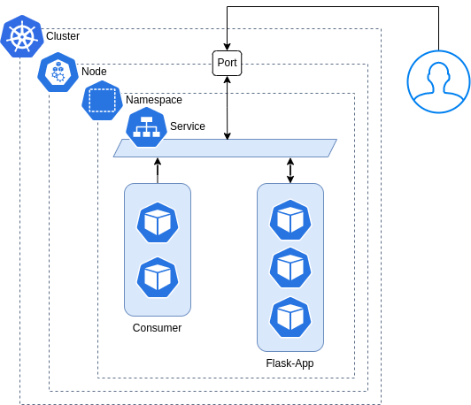
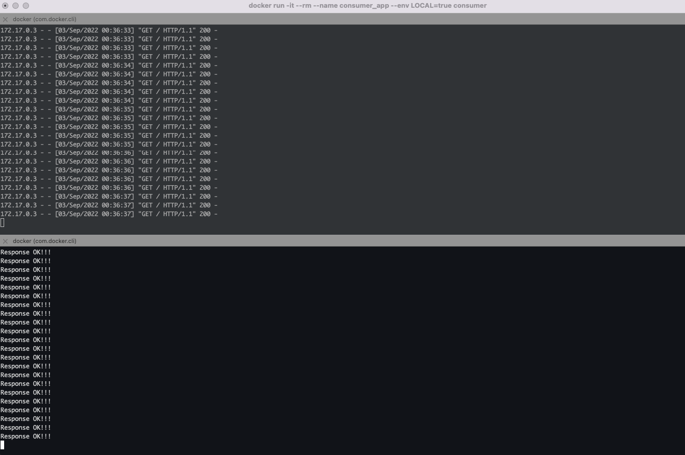

# Challenge-flask-k8s

Este ejemplo crea una API basica de `flask`, con un consumidor que accede desde el service a la API. 
Para exponer la API se creó un servicio tipo NodePort el cual expone un puerto en todos los nodos para que la API sea accesible desde fuera del cluster y por el consumer desde el nodo.

**Requisitos**

- Cluster de k8s (EKS)/minikube/k3s/etc
- Alternativa Killercoda
- Docker
- kubectl

**Desafío**

- Armado de Los Dockerfile de la app y consumer
- Build del APP y el Consumer
- Subir a Docker-hub
- Crear los manifiestos de acuerdo a su analisis cual aplicaría segun el diagrama.
- namespace: Inicial_nombre_apellido
- Service de tipo Nodeport
- Aplicarlos en el cluster eks
- Tips: La app corre sobre el port=8000 y el consumer necesita http://service-flask-app
- imagen de los resultados
- En Clases *live* tienen que desplegar su desafio

**Resultados**

### ------------------

⌨️ con ❤️ por [roxsross](https://github.com/roxsross) 😊

No olvides revisar mi blog [roxsross](https://blog.295devops.com) 😊

y mi linktree [roxsross](https://roxs.295devops.com) 😊

"No se trata de cambiar el mundo, creo que creas un cambio pequeño, pero que te importe estás cambiando las cosas".